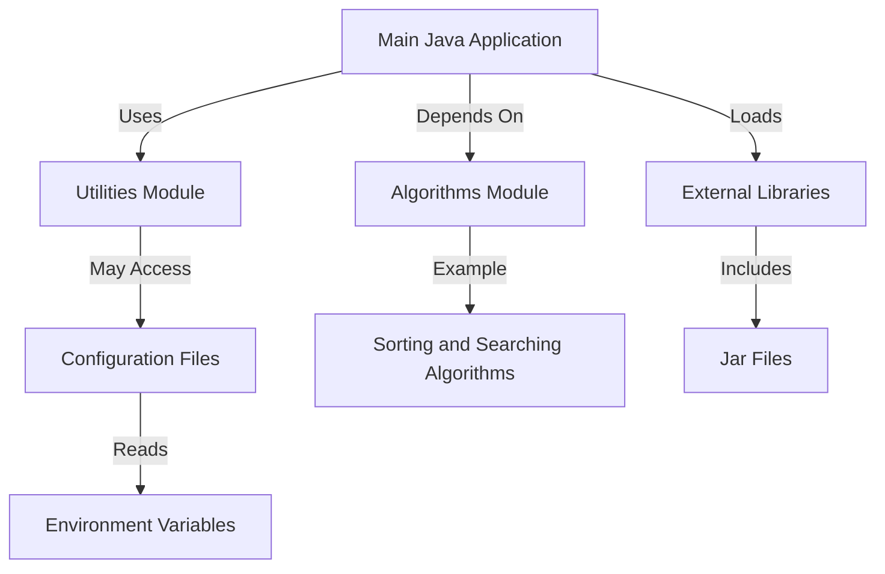

# Java Connection Pool Project

This project demonstrates a simple implementation of a database connection pool in Java using Maven.

## Project Structure

- `src/main/java/org/example/ConnectionPool.java`: Contains the `ConnectionPool` class which manages a pool of database connections.
- `pom.xml`: Maven configuration file for managing project dependencies.

## Prerequisites

- Java 8 or higher
- Maven
- MySQL database

## Setup

1. **Clone the repository**:
    ```sh
    git clone https://github.com/shashankqv/java-work.git
    cd java-work
    ```

2. **Configure the database**:
    - Update the database URL, username, and password in `ConnectionPool.java` to match your MySQL setup.

3. **Build the project**:
    ```sh
    mvn clean install
    ```

## Usage

1. **Run the application**:
    ```sh
    mvn exec:java -Dexec.mainClass="org.example.ConnectionPool"
    ```

2. **Expected Output**:
    ```
    Obtained connection from pool 1.
   Obtained connection from pool 2.
   Pool 1 size: 5
   Pool 2 size: 5
   Used connections from pool 1: 1
   Used connections from pool 2: 1
   Released connection back to pool 1.
   Released connection back to pool 2.
   Used connections from pool 1: 0
   Used connections from pool 2: 0
    ```

## Dependencies

- **MySQL JDBC Driver**: The project uses the MySQL JDBC driver to connect to the MySQL database. The dependency is defined in the `pom.xml` file.


# Java Work & Learning Repository

Welcome to the **Java Work & Learning Repository**! 🎉 This repository is designed as a sandbox for custom Java development and a learning hub for Java programming concepts.

---

## 📚 Purpose

This repository serves as:
1. A **playground** for experimenting with Java code.
2. A **learning resource** for understanding and practicing Java programming concepts.
3. A **showcase** for personal projects, utilities, and algorithms implemented in Java.

---

## 🛠️ Architecture

Below is a high-level architecture diagram that represents how the repository is structured and how its components might interact:



- **Modules**:
  - `Utilities`: Contains helper functions and reusable Java utilities.
  - `Algorithms`: Houses implementations of various algorithms for learning purposes.

---

## 🏗️ Repository Structure

```text
java-work/
├── src/
│   ├── main/
│   │   ├── java/
│   │   │   ├── com/
│   │   │   │   ├── utilities/
│   │   │   │   ├── algorithms/
│   │   │   │   └── app/
│   └── test/
├── lib/
│   ├── external-library.jar
├── config/
│   └── application.properties
└── README.md
```

- `src/main/java`: Contains the primary Java application code.
  - `com.utilities`: Helper functions and utilities.
  - `com.algorithms`: Algorithm implementations.
  - `com.app`: Main Java application logic.
- `src/test`: Unit tests for the code.
- `lib`: External libraries (JAR files) used in the project.
- `config`: Configuration files such as `application.properties`.

---

## 🚀 Getting Started

### Prerequisites
- **Java JDK** version 8 or above.
- **Maven** or **Gradle** for dependency management (if applicable).
- A Java IDE (e.g., IntelliJ IDEA, Eclipse, or VSCode).

### Setup

1. Clone this repository:
   ```bash
   git clone https://github.com/shashankqv/java-work.git
   cd java-work
   ```

2. Open the project in your favorite Java IDE.

3. Build the project:
   ```bash
   # Using Maven
   mvn clean install
   ```

4. Run the application:
   ```bash
   java -jar target/app.jar
   ```

---

## 🌟 Contributing

Contributions are welcome! Feel free to fork the repository and create a pull request to add new Java examples, algorithms, or utilities.

---

## 📜 License

This repository is open-sourced under the [MIT License](LICENSE).

---

Happy coding! 😊
